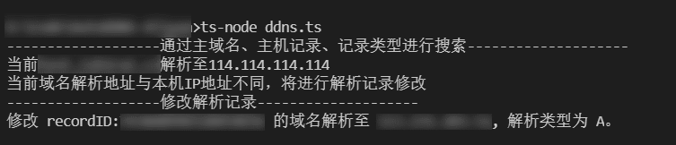

# AutoDDNS-Aliyun

基于`Nodejs`+`TypeScript`和阿里云OpenAPI,ip138API查询实现的DDNS自动解析

# 功能
将指定主域名下的指定二级域名的IP地址动态解析到本机IP

# 配置
在`ipAPI`中填写在[ip138的api服务](https://user.ip138.com/ip/)中申请到的api地址。

在`AK/SK`中填写阿里云OpenAPI的`accessKeyId`与`accessKeySecret`。

在`domainName`中填写要更改的主域名。

在`RR`中填写要更改的一级域名下的主机记录、

`recordType`默认为`A`记录。

# 效果

# 定时任务

考虑到IP地址是在动态变化的，推荐将此程序添加到系统的定时任务中，进行DNS解析的自动更新。